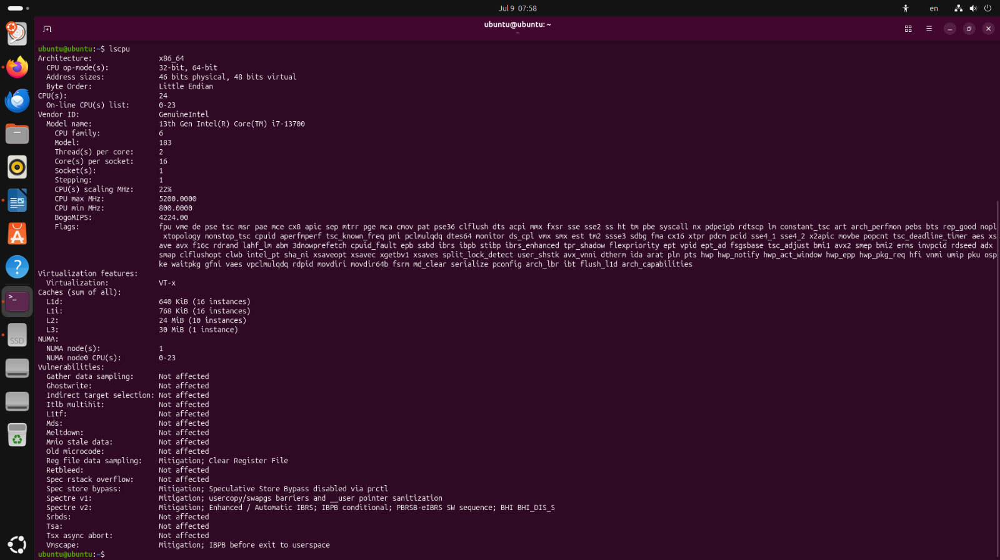
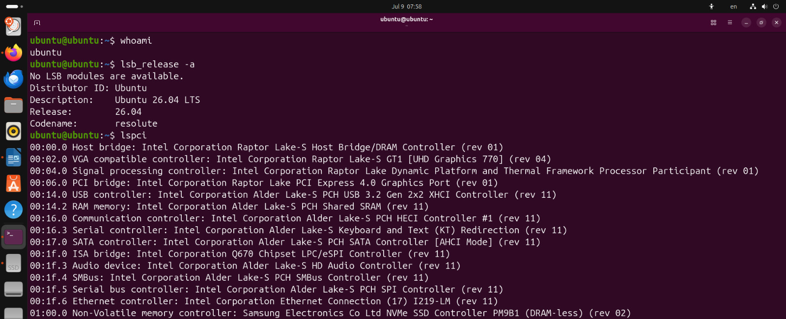

#+options: ':nil *:t -:t ::t <:t H:3 \n:nil ^:t arch:headline
#+options: author:t broken-links:nil c:nil creator:nil
#+options: d:(not "LOGBOOK") date:t e:t email:nil expand-links:t f:t
#+options: inline:t num:t p:nil pri:nil prop:nil stat:t tags:t
#+options: tasks:t tex:t timestamp:t title:t toc:nil todo:t |:t
#+title: Booteo de Sistema Operativo Linux
#+date: 2026-07-10
#+author: Echeverría Steven, Jami Mateo, Pérez Martín y Zúñiga Sebastián. 
#+email: nombre.apellido@epn.edu.ec
#+language: Español
#+select_tags: export
#+exclude_tags: noexport
#+creator: Emacs 27.1 (Org mode 9.7.5)
#+cite_export: biblatex

#+latex_class: article
#+latex_class_options:
#+latex_header:
#+latex_header_extra:
#+description:
#+keywords:
#+subtitle:
#+latex_footnote_command: \footnote{%s%s}
#+latex_engraved_theme:
#+latex_compiler: pdflatex

#+latex_header: \usepackage{fancyhdr}
#+latex_header: \usepackage[top=25mm, left=25mm, right=25mm]{geometry}
#+latex_header: \usepackage{longtable}
#+latex_header: \fancyhead[R]{}
#+latex_header: \setlength\headheight{43.0pt}

#+LATEX_HEADER: \usepackage[T1]{fontenc}
#+LATEX_HEADER: \usepackage[utf8]{inputenc}
#+LATEX_HEADER: \usepackage[spanish]{babel}
#+LATEX_HEADER: \usepackage[backend=biber,style=ieee]{biblatex}

#+begin_export latex
\fancyhead[C]{\includegraphics[scale=0.05]{../imagenes/logoEpn.jpg}\\
ESCUELA POLITÉCNICA NACIONAL\\FACULTAD DE INGENIERÍA DE SISTEMAS\\
ARQUITECTURA DE COMPUTADORES}
\thispagestyle{fancy}
#+end_export

* Objetivos

- Aprender a  bootear un sistema operativo Linux

- Aprender sobre la secuencia de arranque de un computador como la
  BIOS y la UEFI

* Instrucciones
1. Siga el tutorial para la creación de un booteable de Ubuntu como se
   indica en la unidad 9 en el archivo Arranque Ubuntu[fn:2].

2. Realice un respaldo del código de /BitLocker/ utilizando un command
   prompt de Windows con permisos de administrador[fn:1]:

   #+begin_src shell
    manage-bde-protectors C:-get
   #+end_src
   
3. Utilizando su computador o el del laboratorio, siga los pasos
   indicados para obtener el booteo desde el USB con el Sistema
   Operativo de Ubuntu

4. Realice el boot de Ubuntu desde la memoria USB externa y
   seleccione la opción de /Probar Sistema Operativo/.
5. Una vez ingresado active un terminal de Ubuntu: ~Ctrl+ALT+T~ y
   obtenga las características del computador mediante la ejecución de
   los comandos: ~lscpu~, ~lsb_release -a~ y ~lspci~. Obtenga capturas
   de la ejecución de los comandos. Luego abra este archivo en WSL y
   ejecute los comandos desde los bloques shell. Para insertar un
   bloque puede usar la combinación ~C-c C-,~, escoja la opción ~src~
   e indique que es del tipo shell.

* Desarrollo Emacs
Se sugiere utilizar la opción ~:fontsize
scriptsize~ para dar formato a la ejecución del comando. Por ejemplo,
considere:

#+begin_src shell
whoami
#+end_src

#+RESULTS: :fontsize scriptsize 
: sebaszun-epn

** Comando ~lscpu~
#+begin_src shell
 lscpu
#+end_src

#+RESULTS: :fontsize scriptsieze
| Architecture:   | x86_64      |              |             |                 |             |              |          |           |              |       |          |             |     |           |      |     |          |         |     |      |     |      |    |         |    |        |          |         |        |    |              |          |      |              |             |       |             |                |     |           |       |     |      |        |        |       |        |     |       |     |      |        |            |         |            |     |            |     |       |             |               |      |         |              |      |      |      |       |         |          |      |      |      |      |      |         |        |     |      |            |      |        |          |        |         |        |        |            |      |     |           |           |            |             |               |             |             |                 |      |      |            |       |      |
| CPU             | op-mode(s): | 32-bit,      | 64-bit      |                 |             |              |          |           |              |       |          |             |     |           |      |     |          |         |     |      |     |      |    |         |    |        |          |         |        |    |              |          |      |              |             |       |             |                |     |           |       |     |      |        |        |       |        |     |       |     |      |        |            |         |            |     |            |     |       |             |               |      |         |              |      |      |      |       |         |          |      |      |      |      |      |         |        |     |      |            |      |        |          |        |         |        |        |            |      |     |           |           |            |             |               |             |             |                 |      |      |            |       |      |
| Address         | sizes:      | 48           | bits        | physical,       | 48          | bits         | virtual  |           |              |       |          |             |     |           |      |     |          |         |     |      |     |      |    |         |    |        |          |         |        |    |              |          |      |              |             |       |             |                |     |           |       |     |      |        |        |       |        |     |       |     |      |        |            |         |            |     |            |     |       |             |               |      |         |              |      |      |      |       |         |          |      |      |      |      |      |         |        |     |      |            |      |        |          |        |         |        |        |            |      |     |           |           |            |             |               |             |             |                 |      |      |            |       |      |
| Byte            | Order:      | Little       | Endian      |                 |             |              |          |           |              |       |          |             |     |           |      |     |          |         |     |      |     |      |    |         |    |        |          |         |        |    |              |          |      |              |             |       |             |                |     |           |       |     |      |        |        |       |        |     |       |     |      |        |            |         |            |     |            |     |       |             |               |      |         |              |      |      |      |       |         |          |      |      |      |      |      |         |        |     |      |            |      |        |          |        |         |        |        |            |      |     |           |           |            |             |               |             |             |                 |      |      |            |       |      |
| CPU(s):         | 12          |              |             |                 |             |              |          |           |              |       |          |             |     |           |      |     |          |         |     |      |     |      |    |         |    |        |          |         |        |    |              |          |      |              |             |       |             |                |     |           |       |     |      |        |        |       |        |     |       |     |      |        |            |         |            |     |            |     |       |             |               |      |         |              |      |      |      |       |         |          |      |      |      |      |      |         |        |     |      |            |      |        |          |        |         |        |        |            |      |     |           |           |            |             |               |             |             |                 |      |      |            |       |      |
| On-line         | CPU(s)      | list:        | 0-11        |                 |             |              |          |           |              |       |          |             |     |           |      |     |          |         |     |      |     |      |    |         |    |        |          |         |        |    |              |          |      |              |             |       |             |                |     |           |       |     |      |        |        |       |        |     |       |     |      |        |            |         |            |     |            |     |       |             |               |      |         |              |      |      |      |       |         |          |      |      |      |      |      |         |        |     |      |            |      |        |          |        |         |        |        |            |      |     |           |           |            |             |               |             |             |                 |      |      |            |       |      |
| Vendor          | ID:         | AuthenticAMD |             |                 |             |              |          |           |              |       |          |             |     |           |      |     |          |         |     |      |     |      |    |         |    |        |          |         |        |    |              |          |      |              |             |       |             |                |     |           |       |     |      |        |        |       |        |     |       |     |      |        |            |         |            |     |            |     |       |             |               |      |         |              |      |      |      |       |         |          |      |      |      |      |      |         |        |     |      |            |      |        |          |        |         |        |        |            |      |     |           |           |            |             |               |             |             |                 |      |      |            |       |      |
| Model           | name:       | AMD          | Ryzen       | 5               | 7535HS      | with         | Radeon   | Graphics  |              |       |          |             |     |           |      |     |          |         |     |      |     |      |    |         |    |        |          |         |        |    |              |          |      |              |             |       |             |                |     |           |       |     |      |        |        |       |        |     |       |     |      |        |            |         |            |     |            |     |       |             |               |      |         |              |      |      |      |       |         |          |      |      |      |      |      |         |        |     |      |            |      |        |          |        |         |        |        |            |      |     |           |           |            |             |               |             |             |                 |      |      |            |       |      |
| CPU             | family:     | 25           |             |                 |             |              |          |           |              |       |          |             |     |           |      |     |          |         |     |      |     |      |    |         |    |        |          |         |        |    |              |          |      |              |             |       |             |                |     |           |       |     |      |        |        |       |        |     |       |     |      |        |            |         |            |     |            |     |       |             |               |      |         |              |      |      |      |       |         |          |      |      |      |      |      |         |        |     |      |            |      |        |          |        |         |        |        |            |      |     |           |           |            |             |               |             |             |                 |      |      |            |       |      |
| Model:          | 68          |              |             |                 |             |              |          |           |              |       |          |             |     |           |      |     |          |         |     |      |     |      |    |         |    |        |          |         |        |    |              |          |      |              |             |       |             |                |     |           |       |     |      |        |        |       |        |     |       |     |      |        |            |         |            |     |            |     |       |             |               |      |         |              |      |      |      |       |         |          |      |      |      |      |      |         |        |     |      |            |      |        |          |        |         |        |        |            |      |     |           |           |            |             |               |             |             |                 |      |      |            |       |      |
| Thread(s)       | per         | core:        | 2           |                 |             |              |          |           |              |       |          |             |     |           |      |     |          |         |     |      |     |      |    |         |    |        |          |         |        |    |              |          |      |              |             |       |             |                |     |           |       |     |      |        |        |       |        |     |       |     |      |        |            |         |            |     |            |     |       |             |               |      |         |              |      |      |      |       |         |          |      |      |      |      |      |         |        |     |      |            |      |        |          |        |         |        |        |            |      |     |           |           |            |             |               |             |             |                 |      |      |            |       |      |
| Core(s)         | per         | socket:      | 6           |                 |             |              |          |           |              |       |          |             |     |           |      |     |          |         |     |      |     |      |    |         |    |        |          |         |        |    |              |          |      |              |             |       |             |                |     |           |       |     |      |        |        |       |        |     |       |     |      |        |            |         |            |     |            |     |       |             |               |      |         |              |      |      |      |       |         |          |      |      |      |      |      |         |        |     |      |            |      |        |          |        |         |        |        |            |      |     |           |           |            |             |               |             |             |                 |      |      |            |       |      |
| Socket(s):      | 1           |              |             |                 |             |              |          |           |              |       |          |             |     |           |      |     |          |         |     |      |     |      |    |         |    |        |          |         |        |    |              |          |      |              |             |       |             |                |     |           |       |     |      |        |        |       |        |     |       |     |      |        |            |         |            |     |            |     |       |             |               |      |         |              |      |      |      |       |         |          |      |      |      |      |      |         |        |     |      |            |      |        |          |        |         |        |        |            |      |     |           |           |            |             |               |             |             |                 |      |      |            |       |      |
| Stepping:       | 1           |              |             |                 |             |              |          |           |              |       |          |             |     |           |      |     |          |         |     |      |     |      |    |         |    |        |          |         |        |    |              |          |      |              |             |       |             |                |     |           |       |     |      |        |        |       |        |     |       |     |      |        |            |         |            |     |            |     |       |             |               |      |         |              |      |      |      |       |         |          |      |      |      |      |      |         |        |     |      |            |      |        |          |        |         |        |        |            |      |     |           |           |            |             |               |             |             |                 |      |      |            |       |      |
| BogoMIPS:       | 6587.45     |              |             |                 |             |              |          |           |              |       |          |             |     |           |      |     |          |         |     |      |     |      |    |         |    |        |          |         |        |    |              |          |      |              |             |       |             |                |     |           |       |     |      |        |        |       |        |     |       |     |      |        |            |         |            |     |            |     |       |             |               |      |         |              |      |      |      |       |         |          |      |      |      |      |      |         |        |     |      |            |      |        |          |        |         |        |        |            |      |     |           |           |            |             |               |             |             |                 |      |      |            |       |      |
| Flags:          | fpu         | vme          | de          | pse             | tsc         | msr          | pae      | mce       | cx8          | apic  | sep      | mtrr        | pge | mca       | cmov | pat | pse36    | clflush | mmx | fxsr | sse | sse2 | ht | syscall | nx | mmxext | fxsr_opt | pdpe1gb | rdtscp | lm | constant_tsc | rep_good | nopl | tsc_reliable | nonstop_tsc | cpuid | extd_apicid | tsc_known_freq | pni | pclmulqdq | ssse3 | fma | cx16 | sse4_1 | sse4_2 | movbe | popcnt | aes | xsave | avx | f16c | rdrand | hypervisor | lahf_lm | cmp_legacy | svm | cr8_legacy | abm | sse4a | misalignsse | 3dnowprefetch | osvw | topoext | perfctr_core | ssbd | ibrs | ibpb | stibp | vmmcall | fsgsbase | bmi1 | avx2 | smep | bmi2 | erms | invpcid | rdseed | adx | smap | clflushopt | clwb | sha_ni | xsaveopt | xsavec | xgetbv1 | xsaves | clzero | xsaveerptr | arat | npt | nrip_save | tsc_scale | vmcb_clean | flushbyasid | decodeassists | pausefilter | pfthreshold | v_vmsave_vmload | umip | vaes | vpclmulqdq | rdpid | fsrm |
| Virtualization: | AMD-V       |              |             |                 |             |              |          |           |              |       |          |             |     |           |      |     |          |         |     |      |     |      |    |         |    |        |          |         |        |    |              |          |      |              |             |       |             |                |     |           |       |     |      |        |        |       |        |     |       |     |      |        |            |         |            |     |            |     |       |             |               |      |         |              |      |      |      |       |         |          |      |      |      |      |      |         |        |     |      |            |      |        |          |        |         |        |        |            |      |     |           |           |            |             |               |             |             |                 |      |      |            |       |      |
| Hypervisor      | vendor:     | Microsoft    |             |                 |             |              |          |           |              |       |          |             |     |           |      |     |          |         |     |      |     |      |    |         |    |        |          |         |        |    |              |          |      |              |             |       |             |                |     |           |       |     |      |        |        |       |        |     |       |     |      |        |            |         |            |     |            |     |       |             |               |      |         |              |      |      |      |       |         |          |      |      |      |      |      |         |        |     |      |            |      |        |          |        |         |        |        |            |      |     |           |           |            |             |               |             |             |                 |      |      |            |       |      |
| Virtualization  | type:       | full         |             |                 |             |              |          |           |              |       |          |             |     |           |      |     |          |         |     |      |     |      |    |         |    |        |          |         |        |    |              |          |      |              |             |       |             |                |     |           |       |     |      |        |        |       |        |     |       |     |      |        |            |         |            |     |            |     |       |             |               |      |         |              |      |      |      |       |         |          |      |      |      |      |      |         |        |     |      |            |      |        |          |        |         |        |        |            |      |     |           |           |            |             |               |             |             |                 |      |      |            |       |      |
| L1d             | cache:      | 192          | KiB         | (6              | instances)  |              |          |           |              |       |          |             |     |           |      |     |          |         |     |      |     |      |    |         |    |        |          |         |        |    |              |          |      |              |             |       |             |                |     |           |       |     |      |        |        |       |        |     |       |     |      |        |            |         |            |     |            |     |       |             |               |      |         |              |      |      |      |       |         |          |      |      |      |      |      |         |        |     |      |            |      |        |          |        |         |        |        |            |      |     |           |           |            |             |               |             |             |                 |      |      |            |       |      |
| L1i             | cache:      | 192          | KiB         | (6              | instances)  |              |          |           |              |       |          |             |     |           |      |     |          |         |     |      |     |      |    |         |    |        |          |         |        |    |              |          |      |              |             |       |             |                |     |           |       |     |      |        |        |       |        |     |       |     |      |        |            |         |            |     |            |     |       |             |               |      |         |              |      |      |      |       |         |          |      |      |      |      |      |         |        |     |      |            |      |        |          |        |         |        |        |            |      |     |           |           |            |             |               |             |             |                 |      |      |            |       |      |
| L2              | cache:      | 3            | MiB         | (6              | instances)  |              |          |           |              |       |          |             |     |           |      |     |          |         |     |      |     |      |    |         |    |        |          |         |        |    |              |          |      |              |             |       |             |                |     |           |       |     |      |        |        |       |        |     |       |     |      |        |            |         |            |     |            |     |       |             |               |      |         |              |      |      |      |       |         |          |      |      |      |      |      |         |        |     |      |            |      |        |          |        |         |        |        |            |      |     |           |           |            |             |               |             |             |                 |      |      |            |       |      |
| L3              | cache:      | 16           | MiB         | (1              | instance)   |              |          |           |              |       |          |             |     |           |      |     |          |         |     |      |     |      |    |         |    |        |          |         |        |    |              |          |      |              |             |       |             |                |     |           |       |     |      |        |        |       |        |     |       |     |      |        |            |         |            |     |            |     |       |             |               |      |         |              |      |      |      |       |         |          |      |      |      |      |      |         |        |     |      |            |      |        |          |        |         |        |        |            |      |     |           |           |            |             |               |             |             |                 |      |      |            |       |      |
| NUMA            | node(s):    | 1            |             |                 |             |              |          |           |              |       |          |             |     |           |      |     |          |         |     |      |     |      |    |         |    |        |          |         |        |    |              |          |      |              |             |       |             |                |     |           |       |     |      |        |        |       |        |     |       |     |      |        |            |         |            |     |            |     |       |             |               |      |         |              |      |      |      |       |         |          |      |      |      |      |      |         |        |     |      |            |      |        |          |        |         |        |        |            |      |     |           |           |            |             |               |             |             |                 |      |      |            |       |      |
| NUMA            | node0       | CPU(s):      | 0-11        |                 |             |              |          |           |              |       |          |             |     |           |      |     |          |         |     |      |     |      |    |         |    |        |          |         |        |    |              |          |      |              |             |       |             |                |     |           |       |     |      |        |        |       |        |     |       |     |      |        |            |         |            |     |            |     |       |             |               |      |         |              |      |      |      |       |         |          |      |      |      |      |      |         |        |     |      |            |      |        |          |        |         |        |        |            |      |     |           |           |            |             |               |             |             |                 |      |      |            |       |      |
| Vulnerability   | Gather      | data         | sampling:   | Not             | affected    |              |          |           |              |       |          |             |     |           |      |     |          |         |     |      |     |      |    |         |    |        |          |         |        |    |              |          |      |              |             |       |             |                |     |           |       |     |      |        |        |       |        |     |       |     |      |        |            |         |            |     |            |     |       |             |               |      |         |              |      |      |      |       |         |          |      |      |      |      |      |         |        |     |      |            |      |        |          |        |         |        |        |            |      |     |           |           |            |             |               |             |             |                 |      |      |            |       |      |
| Vulnerability   | Itlb        | multihit:    | Not         | affected        |             |              |          |           |              |       |          |             |     |           |      |     |          |         |     |      |     |      |    |         |    |        |          |         |        |    |              |          |      |              |             |       |             |                |     |           |       |     |      |        |        |       |        |     |       |     |      |        |            |         |            |     |            |     |       |             |               |      |         |              |      |      |      |       |         |          |      |      |      |      |      |         |        |     |      |            |      |        |          |        |         |        |        |            |      |     |           |           |            |             |               |             |             |                 |      |      |            |       |      |
| Vulnerability   | L1tf:       | Not          | affected    |                 |             |              |          |           |              |       |          |             |     |           |      |     |          |         |     |      |     |      |    |         |    |        |          |         |        |    |              |          |      |              |             |       |             |                |     |           |       |     |      |        |        |       |        |     |       |     |      |        |            |         |            |     |            |     |       |             |               |      |         |              |      |      |      |       |         |          |      |      |      |      |      |         |        |     |      |            |      |        |          |        |         |        |        |            |      |     |           |           |            |             |               |             |             |                 |      |      |            |       |      |
| Vulnerability   | Mds:        | Not          | affected    |                 |             |              |          |           |              |       |          |             |     |           |      |     |          |         |     |      |     |      |    |         |    |        |          |         |        |    |              |          |      |              |             |       |             |                |     |           |       |     |      |        |        |       |        |     |       |     |      |        |            |         |            |     |            |     |       |             |               |      |         |              |      |      |      |       |         |          |      |      |      |      |      |         |        |     |      |            |      |        |          |        |         |        |        |            |      |     |           |           |            |             |               |             |             |                 |      |      |            |       |      |
| Vulnerability   | Meltdown:   | Not          | affected    |                 |             |              |          |           |              |       |          |             |     |           |      |     |          |         |     |      |     |      |    |         |    |        |          |         |        |    |              |          |      |              |             |       |             |                |     |           |       |     |      |        |        |       |        |     |       |     |      |        |            |         |            |     |            |     |       |             |               |      |         |              |      |      |      |       |         |          |      |      |      |      |      |         |        |     |      |            |      |        |          |        |         |        |        |            |      |     |           |           |            |             |               |             |             |                 |      |      |            |       |      |
| Vulnerability   | Mmio        | stale        | data:       | Not             | affected    |              |          |           |              |       |          |             |     |           |      |     |          |         |     |      |     |      |    |         |    |        |          |         |        |    |              |          |      |              |             |       |             |                |     |           |       |     |      |        |        |       |        |     |       |     |      |        |            |         |            |     |            |     |       |             |               |      |         |              |      |      |      |       |         |          |      |      |      |      |      |         |        |     |      |            |      |        |          |        |         |        |        |            |      |     |           |           |            |             |               |             |             |                 |      |      |            |       |      |
| Vulnerability   | Reg         | file         | data        | sampling:       | Not         | affected     |          |           |              |       |          |             |     |           |      |     |          |         |     |      |     |      |    |         |    |        |          |         |        |    |              |          |      |              |             |       |             |                |     |           |       |     |      |        |        |       |        |     |       |     |      |        |            |         |            |     |            |     |       |             |               |      |         |              |      |      |      |       |         |          |      |      |      |      |      |         |        |     |      |            |      |        |          |        |         |        |        |            |      |     |           |           |            |             |               |             |             |                 |      |      |            |       |      |
| Vulnerability   | Retbleed:   | Not          | affected    |                 |             |              |          |           |              |       |          |             |     |           |      |     |          |         |     |      |     |      |    |         |    |        |          |         |        |    |              |          |      |              |             |       |             |                |     |           |       |     |      |        |        |       |        |     |       |     |      |        |            |         |            |     |            |     |       |             |               |      |         |              |      |      |      |       |         |          |      |      |      |      |      |         |        |     |      |            |      |        |          |        |         |        |        |            |      |     |           |           |            |             |               |             |             |                 |      |      |            |       |      |
| Vulnerability   | Spec        | rstack       | overflow:   | Vulnerable:     | Safe        | RET,         | no       | microcode |              |       |          |             |     |           |      |     |          |         |     |      |     |      |    |         |    |        |          |         |        |    |              |          |      |              |             |       |             |                |     |           |       |     |      |        |        |       |        |     |       |     |      |        |            |         |            |     |            |     |       |             |               |      |         |              |      |      |      |       |         |          |      |      |      |      |      |         |        |     |      |            |      |        |          |        |         |        |        |            |      |     |           |           |            |             |               |             |             |                 |      |      |            |       |      |
| Vulnerability   | Spec        | store        | bypass:     | Mitigation;     | Speculative | Store        | Bypass   | disabled  | via          | prctl |          |             |     |           |      |     |          |         |     |      |     |      |    |         |    |        |          |         |        |    |              |          |      |              |             |       |             |                |     |           |       |     |      |        |        |       |        |     |       |     |      |        |            |         |            |     |            |     |       |             |               |      |         |              |      |      |      |       |         |          |      |      |      |      |      |         |        |     |      |            |      |        |          |        |         |        |        |            |      |     |           |           |            |             |               |             |             |                 |      |      |            |       |      |
| Vulnerability   | Spectre     | v1:          | Mitigation; | usercopy/swapgs | barriers    | and          | __user   | pointer   | sanitization |       |          |             |     |           |      |     |          |         |     |      |     |      |    |         |    |        |          |         |        |    |              |          |      |              |             |       |             |                |     |           |       |     |      |        |        |       |        |     |       |     |      |        |            |         |            |     |            |     |       |             |               |      |         |              |      |      |      |       |         |          |      |      |      |      |      |         |        |     |      |            |      |        |          |        |         |        |        |            |      |     |           |           |            |             |               |             |             |                 |      |      |            |       |      |
| Vulnerability   | Spectre     | v2:          | Mitigation; | Retpolines;     | IBPB        | conditional; | IBRS_FW; | STIBP     | always-on;   | RSB   | filling; | PBRSB-eIBRS | Not | affected; | BHI  | Not | affected |         |     |      |     |      |    |         |    |        |          |         |        |    |              |          |      |              |             |       |             |                |     |           |       |     |      |        |        |       |        |     |       |     |      |        |            |         |            |     |            |     |       |             |               |      |         |              |      |      |      |       |         |          |      |      |      |      |      |         |        |     |      |            |      |        |          |        |         |        |        |            |      |     |           |           |            |             |               |             |             |                 |      |      |            |       |      |
| Vulnerability   | Srbds:      | Not          | affected    |                 |             |              |          |           |              |       |          |             |     |           |      |     |          |         |     |      |     |      |    |         |    |        |          |         |        |    |              |          |      |              |             |       |             |                |     |           |       |     |      |        |        |       |        |     |       |     |      |        |            |         |            |     |            |     |       |             |               |      |         |              |      |      |      |       |         |          |      |      |      |      |      |         |        |     |      |            |      |        |          |        |         |        |        |            |      |     |           |           |            |             |               |             |             |                 |      |      |            |       |      |
| Vulnerability   | Tsx         | async        | abort:      | Not             | affected    |              |          |           |              |       |          |             |     |           |      |     |          |         |     |      |     |      |    |         |    |        |          |         |        |    |              |          |      |              |             |       |             |                |     |           |       |     |      |        |        |       |        |     |       |     |      |        |            |         |            |     |            |     |       |             |               |      |         |              |      |      |      |       |         |          |      |      |      |      |      |         |        |     |      |            |      |        |          |        |         |        |        |            |      |     |           |           |            |             |               |             |             |                 |      |      |            |       |      |

** Comando ~lsb_release~
   #+begin_src shell
    lsb_release -a
   #+end_src

   #+RESULTS: :fontsize scriptsize
   | Distributor ID: | Ubuntu             |
   | Description:    | Ubuntu 24.04.4 LTS |
   | Release:        | 24.04              |
   | Codename:       | noble              |

** Comando ~lspci~
  #+begin_src shell
   lspci
  #+end_src

  #+RESULTS: :fontsize scriptsize
  | 0d65:00:00.0 | System | peripheral: | Red         | Hat,        | Inc.  | Virtio | file   | system | (rev    |  01) |     |
  | 5582:00:00.0 |   SCSI | storage     | controller: | Red         | Hat,  | Inc.   | Virtio |    1.0 | console | (rev | 01) |
  | 5cce:00:00.0 |     3D | controller: | Microsoft   | Corporation | Basic | Render | Driver |        |         |      |     |
  | 9694:00:00.0 |     3D | controller: | Microsoft   | Corporation | Basic | Render | Driver |        |         |      |     |

* Desarrollo Capturas
Coloque las capturas de los resultados obtenidos en los
terminales. Para esto recuerde utilizar dobles corchetes y escribir el
/path/ hacia la imagen. Pruebe a utilizar YASnipet para generar el
siguiente código para descripción de la figura. Para esto puede
escriba ~fig_~ seguido de la combinación de teclas ~C-TAB~, finalmente
coloque la dirección de la imagen. Las figuras se presentaron en la
siguiente parte de la consulta, por motivos de espacio y orientación
en LaTex.

* Consulta
Describa que hacen y para qué sirven los comandos utilizados en la práctica

- lscpu :: Muestra información detallada sobre la arquitectura del
  procesador (CPU) del sistema. Recopila datos directamente
  de los archivos internos del sistema (/proc/cpuinfo) y de la
  arquitectura de la máquina para presentar un resumen estructurado
  del hardware de procesamiento. Además, sirve para conocer la
  potencia, la estructura y las capacidades técnicas del procesador.
#+caption: lscpu
#+attr_latex: scale=0.75
#+label: fig:lscpu

  
- lspci :: Muestra una lista detallada de todos los dispositivos
  conectados a los puertos PCI y PCI Express de la placa base.
  De igual forma, ayuda a identificar los componentes físicos de la máquina.
   
- lsb_release -a :: Muestra información específica sobre la
  distribución de Linux instalada.Permite verificar la versión exacta
  del sistema operativo y su nombre en clave.

#+caption: lsb_release -a y lspci
#+attr_latex: scale=0.75
#+label: fig:lscpu

* Footnotes
[fn:2]Dependiendo de las características de su computador debe
verificar si al crear el medio booteable para Ubuntu, su sistema
reconoce o acepta para el /Target System/

[fn:1]Si no respalda el código, no podrá arrancar el disco luego de
reiniciar. Más información en: [[https://www.partitionwizard.com/disk-recovery/bitlocker-recovery-key-bypass.html
 ][https://www.partitionwizard.com/disk-recovery/bitlocker-recovery-key-bypass.html]]
