#+OPTIONS: num:nil toc:nil timestamp:nil
#+REVEAL_ROOT: https://cdn.jsdelivr.net/npm/reveal.js
#+REVEAL_THEME: dracula
#+REVEAL_TRANS: slide
#+REVEAL_SPEED: default
#+REVEAL_SLIDE_NUMBER: c/t
#+REVEAL_HLEVEL: 1
#+REVEAL_PLUGINS: (highlight notes math)
#+REVEAL_MATHJAX: t
#+REVEAL_MATHJAX_URL: https://cdn.jsdelivr.net/npm/mathjax@3/es5/tex-mml-chtml.js
#+REVEAL_INIT_OPTIONS: width:1200, height:900, margin: 0.1, minScale:0.2, maxScale:1.2
#+REVEAL_EXTRA_CSS: https://use.fontawesome.com/releases/v5.15.4/css/all.css
#+REVEAL_EXTRA_CSS: ./custom.css

#+TITLE: Memoria Interna
#+AUTHOR: Echeverría Steven, Jami Mateo, Pérez Martín y Zúñiga Sebastián
#+DATE: 2026-07-02
#+LANGUAGE: es

* 1. Más allá de la memoria caché
** @@html:<i class="fas fa-microchip"></i>@@ Arquitectura de Computadores
#+begin_export html

  
1
 
  <h2>La memoria principal o Random Access Memory (RAM) es fundamental en el funcionamiento de los computadores</h2>
  
 Ahondemos en las características, funcionamiento y otros aspectos sobre este componente

#+end_export

* 2. Organización de la memoria interna
** @@html:<i class="fas fa-microchip"></i>@@ ¿Cómo funciona exactamente una memoria?
#+ATTR_REVEAL: :frag (appear)
- La unidad fundamental de la memoria semiconductora es una celda de
  memoria. Sus propiedades  son:
- Poseen dos estados estables o semiestables que representan el 1
    y  0 lógico.
- Al escribir en ellas, es posible fijar su estado.
- Al leerlas, se detecta su estado.
#+ATTR_HTML: :width 70% :align center
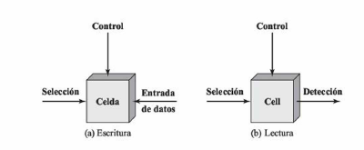
  

* 3. DRAM
** @@html:<i class="fas fa-microchip"></i>@@ DRAM (RAM Dinámica)
#+ATTR_REVEAL: :frag (appear)
#+begin_export html

  <strong>El estándar para Memoria Principal.</strong>

  

#+end_export
- @@html:<strong>@@Estructura:@@html:</strong>@@ 1 transistor + 1 condensador.
- @@html:<strong>@@Lógica:@@html:</strong>@@ El bit se almacena como @@html:<em>@@carga eléctrica@@html:</em>@@ (naturaleza analógica).
- @@html:<strong>@@Reto:@@html:</strong>@@ El condensador pierde carga rápidamente. Requiere un @@html:<strong>refresco periódico</strong>@@ para no perder los datos.
#+begin_export html
  

  

#+end_export
#+ATTR_HTML: :width 60% :align center
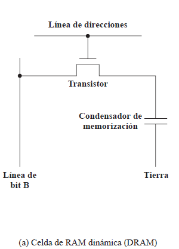
#+begin_export html
  

#+end_export

* 4. SRAM
** @@html:<i class="fas fa-microchip"></i>@@ SRAM (RAM Estática)
#+ATTR_REVEAL: :frag (appear)
#+begin_export html

  <strong>El estándar para Memoria Caché.</strong>

  

#+end_export
- @@html:<strong>@@Estructura:@@html:</strong>@@ 6 transistores configurados como un biestable (Flip-Flop).
- @@html:<strong>@@Lógica:@@html:</strong>@@ Dispositivo puramente digital.
- @@html:<strong>@@Ventaja:@@html:</strong>@@ Mientras haya energía, el dato es estable. @@html:<strong>No necesita refrescos</strong>@@.
#+begin_export html
  

  

#+end_export
#+ATTR_HTML: :width 60% :align center
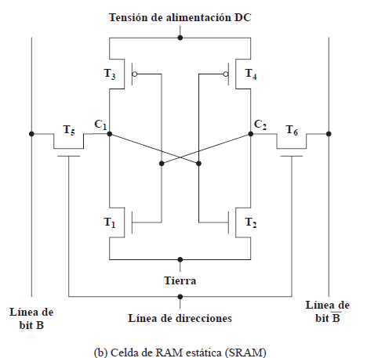

#+begin_export html
  

#+end_export

* 5. DRAM vs SRAM
** @@html:<i class="fas fa-balance-scale"></i>@@ Comparativa
#+ATTR_REVEAL: :frag (appear)
¿Por qué no usar la memoria más rápida en todo el sistema?

#+begin_export html
<table style="width:100%; text-align:center; margin-top:20px;">
  <thead style="background-color:#1E3A5A; color:#7ECFFF;">
    <tr>
      <th></th>
      <th>DRAM (Dinámica)</th>
      <th>SRAM (Estática)</th>
    </tr>
  </thead>
  <tbody style="background-color:#141E2C;">
    <tr>
      <td><strong>Densidad</strong></td>
      <td style="color:#00B894; font-weight:bold;">Más Alta</td>
      <td style="color:#D63031; font-weight:bold;">Baja</td>
    </tr>
    <tr>
      <td><strong>Costo</strong></td>
      <td style="color:#00B894; font-weight:bold;">Más Barata</td>
      <td style="color:#D63031; font-weight:bold;">Costosa</td>
    </tr>
    <tr>
      <td><strong>Velocidad</strong></td>
      <td style="color:#D63031; font-weight:bold;">Algo más lenta</td>
      <td style="color:#00B894; font-weight:bold;">Rápida</td>
    </tr>
    <tr>
      <td><strong>Refrescos</strong></td>
      <td style="color:#D63031; font-weight:bold;">Sí (Periódicos)</td>
      <td style="color:#00B894; font-weight:bold;">No (Constante)</td>
    </tr>
    <tr>
      <td><strong>Uso Ideal</strong></td>
      <td>Memoria Principal (RAM)</td>
      <td>Memoria Caché (L1/L2)</td>
    </tr>
  </tbody>
</table>
#+end_export

* 6. Memorias ROM
** @@html:<i class="fas fa-memory"></i>@@ Evolución de las Memorias ROM
#+begin_export html

  <strong>La necesidad de flexibilidad:</strong> La ROM es no-volátil y nació como "Solo Lectura", pero la necesidad de actualizar el firmware impulsó métodos de borrado cada vez más avanzados.

#+end_export

#+ATTR_REVEAL: :frag (appear)
- @@html:<strong>ROM (Máscara):</strong>@@ Programada físicamente en fábrica. @@html:<strong>Imborrable</strong>@@ y cero margen de error.
- @@html:<strong>PROM:</strong>@@ Programable por el usuario @@html:<em>@@una sola vez@@html:</em>@@ (quemando fusibles internos).
- @@html:<strong>EPROM:</strong>@@ Borrable con @@html:luz ultravioleta@@ (tarda hasta 20 minutos y borra @@html:<em>@@todo@@html:</em>@@ el chip).
- @@html:<strong>EEPROM:</strong>@@ Borrable @@html:eléctricamente a nivel de byte@@. Flexible, pero costosa y menos densa.
- @@html:<strong>Flash Memory:</strong>@@ Borrable eléctricamente @@html:<strong>por bloques</strong>@@. Combina la altísima densidad de EPROM con la flexibilidad eléctrica. El estándar actual.

* 7. Lógica del chip
** @@html:<i class="fas fa-microchip"></i>@@ Estructura de Datos y Matriz
#+ATTR_REVEAL: :frag (appear)
#+begin_export html

  <strong>Consideración principal:</strong> Al diseñar una memoria semiconductora, es importante considerar el número de bits de datos que pueden ser leídos o escritos a la vez.

#+end_export

#+ATTR_REVEAL: :frag (appear)
- Procurar que la disposición física de la matriz sea igual a la disposición lógica. La matriz posee \(\color{#bd93f9}{W}\) palabras con \(\color{#bd93f9}{n}\) bits cada una.
- Organizar la memoria mediante la forma @@html:<strong>un-bit-por-chip</strong>@@, cada chip almacena un solo bit de cada palabra en cada dirección.

** @@html:<i class="fas fa-layer-group"></i>@@ Las líneas en una memoria DRAM
#+begin_export html

  Existen determinados tipos de líneas que permiten realizar las operaciones de lectura y escritura en la matriz de una memoria semiconductora.

#+end_export

#+ATTR_REVEAL: :frag (appear)
- @@html:<strong>Líneas de direcciones:</strong>@@ llegan del procesador y envían señales para activar una celda específica. Requeridas: \(\color{#ffb86c}{\log_2(W)}\).
- @@html:<strong>Líneas de datos:</strong>@@ esenciales para operaciones de escritura y lectura.
- @@html:<strong>Líneas horizontales:</strong>@@ (líneas de palabras), activan toda una fila de bits.
- @@html:<strong>Líneas verticales:</strong>@@ (líneas de bits), transportan el voltaje del bit que se va a escribir, o bien reciben el bit que se ha leído.

** @@html:<i class="fas fa-exchange-alt"></i>@@ Proceso de lectura y escritura
#+ATTR_REVEAL: :frag (appear)
- Matriz compuesta por 4 matrices cuadradas de \(\color{#ffb86c}{2048 \cdot 2048}\) elementos.
- Celdas acopladas a líneas horizontales (selección) y verticales (Entrada-Datos/Detección).
- @@html:<strong>Se leen o escriben cuatro bits a la vez:</strong>@@ se activan filas y se leen 4 columnas indicadas por el decodificador.
- @@html:<strong>Para la lectura:</strong>@@ se pasa cada línea por un @@html:<em>amplificador de lectura</em>@@.
- @@html:<strong>Para la escritura:</strong>@@ se activa cada línea a 1 o 0 según líneas de datos.

** @@html:<i class="fas fa-clock"></i>@@ Multiplexación y Refresco en DRAM
#+ATTR_REVEAL: :frag (appear)
- @@html:<strong>Multiplexación en el tiempo:</strong>@@permite usar 11 líneas en lugar de 22:
  1. Once señales de dirección para filas.
  2. Luego las mismas líneas para columnas.
- @@html:<strong>Refresco:</strong>@@ evita pérdida de bits en DRAM. Técnica:
  1. Inhabilitar todas las celdas.
  2. Contador recorre celdas, pasa bit al decodificador de filas y activa RAS.
  3. Datos se leen y escriben nuevamente.

* 8. Encapsulación del chip
** @@html:<i class="fas fa-box"></i>@@ Encapsulación del Chip
#+begin_export html

  <strong>Terminales:</strong> Circuitos integrados se montan con patillas que los conectan al exterior. 
#+end_export

#+ATTR_REVEAL: :frag (appear)

#+begin_export html

  

    <h3>Memoria EPROMs:</h3>

    <ul style="font-size: 0.8em;">
      <li>Esta memoria sí permite borrar sus datos guardados.</li>
      <li>Una EPROM encapsulada de 8 Mb posee un millón de palabras, cada una de 8 bits.</li>

      <li>
        Se requiere de 32 terminales para almacenar dichas palabras, cada una con las siguientes funciones:
        <ul>
          <li>La dirección de la palabra a la que se accede.</li>
          <li><strong>Número total de terminales de direcciones:</strong> \(n=\log_2(W)=20\).</li>
          <li>El dato a leer (ocho líneas).</li>
          <li>Línea de alimentación del chip \(V_{CC}\).</li>
          <li>Un terminal de tierra \(V_{SS}\).</li>
          <li>Habilitación del chip (CE).</li>
          <li>Una tensión de programación \(V_{PP}\).</li>
        </ul>
      </li>
    </ul>
  

  

   

       
   

  

#+end_export

* 9. Organización en módulos

#+begin_export html

  

    <h3>Memoria RAM de 256 KB</h3>
#+end_export

#+ATTR_HTML: :width 90%
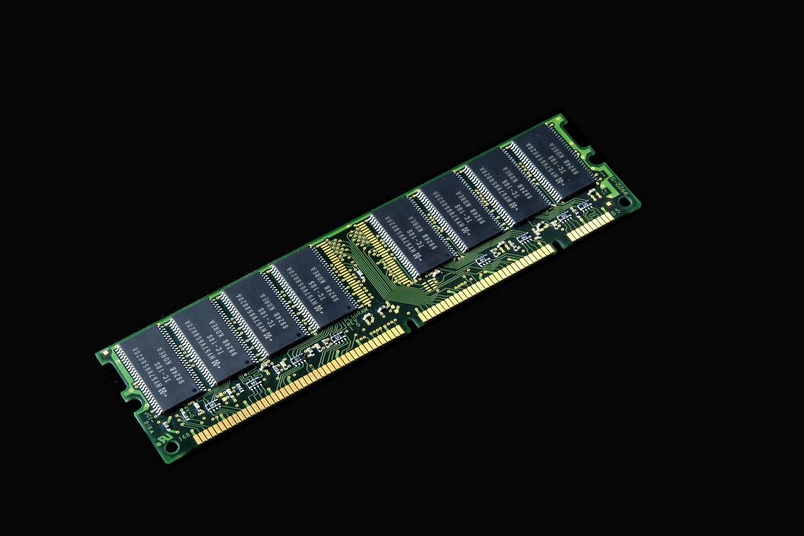

#+begin_export html
  

  

    <h3>Memoria RAM de 1 MB</h3>
#+end_export

#+ATTR_HTML: :width 90%
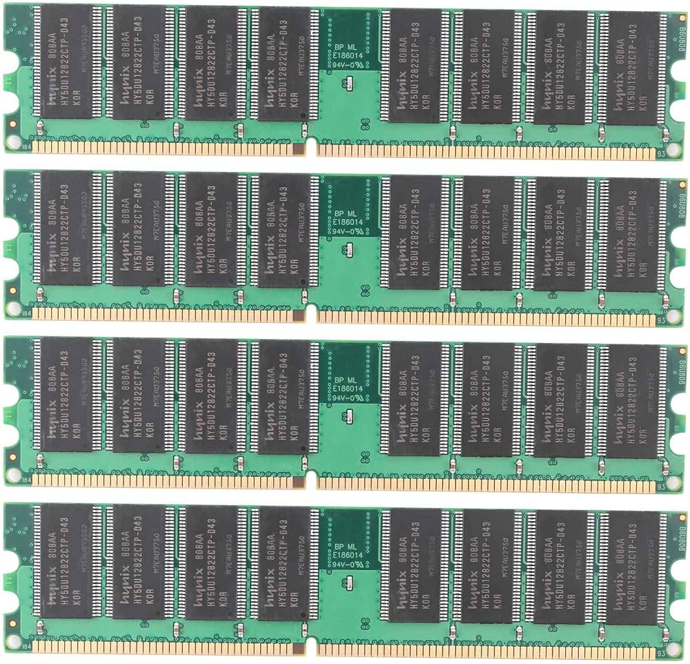

#+begin_export html
  

#+end_export

* 10. Correccion de Errores y código de Hamming
** @@html:<i class="fas fa-exclamation-triangle"></i>@@ Hard Error vs Soft Error
#+ATTR_REVEAL: :frag (appear)
Los sistemas de memoria están sujetos a fallos. Se dividen en dos familias principales:

#+begin_export html

  <strong>Hard Error (Fallo Físico)</strong> 
  Un defecto <strong>permanente</strong> en el hardware. Celdas que conmutan de manera errónea o que se quedan atascadas en 0 o 1.  
  &rarr; <strong>Causas:</strong> Desgaste, defectos de fábrica, daño eléctrico o térmico.  
  &rarr; <strong>Solución:</strong> <strong>Irreversible</strong>. Hay que reemplazar el chip.

  <strong>Soft Error (Fallo Transitorio)</strong> 
  Un evento <strong>aleatorio y no destructivo</strong>. Uno o más bits son alterados, pero el chip sigue siendo funcional.  
  &rarr; <strong>Causas:</strong> Ruido eléctrico, <strong>emisión radiactiva</strong> (partículas alfa).  
  &rarr; <strong>Solución:</strong> <strong>Corregible</strong>. Si se detecta, se pueden volver a escribir los bits correctos.

#+end_export

** @@html:<i class="fas fa-shield-alt"></i>@@ Control de Errores en Memoria
Para lidiar con los errores, se implementan lógicas de detección y corrección en el flujo de lectura y escritura de la memoria.

#+ATTR_HTML: :width 80% :align center
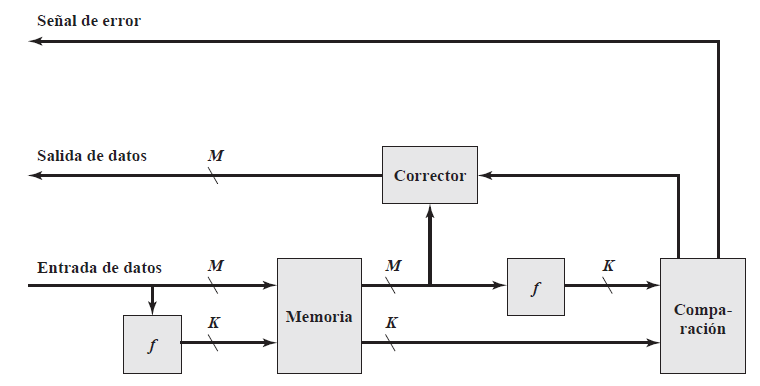

** @@html:<i class="fas fa-barcode"></i>@@ Código de Hamming: Concepto General
Para corregir un @@html:<em>@@Soft Error@@html:</em>@@, no basta con saber @@html:<em>@@que@@html:</em>@@ ocurrió un error, tenemos que saber @@html:<strong>@@exactamente dónde ocurrió@@html:</strong>@@.

#+begin_export html

  

#+end_export
- @@html:<strong>@@La idea:@@html:</strong>@@ Añadir bits de comprobación a nuestros datos.
- Richard Hamming descubrió que ubicando estos guardianes en posiciones que son @@html:<strong>potencias de 2</strong>@@, podemos generar un código matemático infalible.
- El cruce de información (intersección en los diagramas de Venn) delata matemáticamente al bit dañado.
#+begin_export html
  

  

#+end_export
#+ATTR_HTML: :width 95% :align center
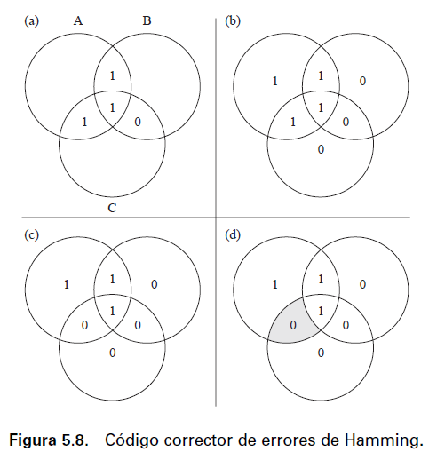
#+begin_export html
  

#+end_export

** @@html:<i class="fas fa-calculator"></i>@@ Código de Hamming: Bits de comprobación
Para que el hardware pueda corregir un error, los bits de comprobación deben ser capaces de identificar:
- Cada una de las posibles posiciones donde puede ocurrir un error.
- El caso en que @@html:<strong>@@no exista ningún error@@html:</strong>@@.

Si una palabra contiene:
- \(M\) bits de datos
- \(k\) bits de comprobación

entonces existen \((M+k)\) posibles posiciones de error y un caso adicional de "sin error".

#+begin_export html

  <strong>Condición de Hamming</strong> 
  Los \(k\) bits de comprobación generan \(2^k\) combinaciones posibles, por lo que debe cumplirse:  
  
\(2^{k}-1 \ge M+k\)

  
\(M\) = número de bits de datos &nbsp;&nbsp;&nbsp;&nbsp; \(k\) = número de bits de comprobación

#+end_export

** @@html:<i class="fas fa-table"></i>@@ Código de Hamming: Ejemplos
Aplicando la condición \(2^{k}-1 \ge M+k\) obtenemos:

#+begin_export html
<table style="width:100%; text-align:center; margin-top:20px; border-collapse: collapse;">
  <thead style="background-color:#1E3A5A; color:#7ECFFF;">
    <tr>
      <th style="padding: 10px; border: 1px solid #2A4A6A;">Datos (\(M\))</th>
      <th style="padding: 10px; border: 1px solid #2A4A6A;">Bits de comprobación (\(k\))</th>
      <th style="padding: 10px; border: 1px solid #2A4A6A;">Palabra final</th>
      <th style="padding: 10px; border: 1px solid #2A4A6A;">Incremento</th>
    </tr>
  </thead>
  <tbody style="background-color:#141E2C;">
    <tr>
      <td style="padding: 10px; border: 1px solid #2A4A6A;">4</td><td style="padding: 10px; border: 1px solid #2A4A6A;">3</td><td style="padding: 10px; border: 1px solid #2A4A6A;">7</td><td style="padding: 10px; border: 1px solid #2A4A6A; color:#F0C040;"><strong>75%</strong></td>
    </tr>
    <tr>
      <td style="padding: 10px; border: 1px solid #2A4A6A;">8</td><td style="padding: 10px; border: 1px solid #2A4A6A;">4</td><td style="padding: 10px; border: 1px solid #2A4A6A;">12</td><td style="padding: 10px; border: 1px solid #2A4A6A; color:#F0C040;"><strong>50%</strong></td>
    </tr>
    <tr>
      <td style="padding: 10px; border: 1px solid #2A4A6A;">16</td><td style="padding: 10px; border: 1px solid #2A4A6A;">5</td><td style="padding: 10px; border: 1px solid #2A4A6A;">21</td><td style="padding: 10px; border: 1px solid #2A4A6A; color:#F0C040;"><strong>31.25%</strong></td>
    </tr>
    <tr>
      <td style="padding: 10px; border: 1px solid #2A4A6A;">32</td><td style="padding: 10px; border: 1px solid #2A4A6A;">6</td><td style="padding: 10px; border: 1px solid #2A4A6A;">38</td><td style="padding: 10px; border: 1px solid #2A4A6A; color:#F0C040;"><strong>18.75%</strong></td>
    </tr>
    <tr>
      <td style="padding: 10px; border: 1px solid #2A4A6A;">64</td><td style="padding: 10px; border: 1px solid #2A4A6A;">7</td><td style="padding: 10px; border: 1px solid #2A4A6A;">71</td><td style="padding: 10px; border: 1px solid #2A4A6A; color:#F0C040;"><strong>10.94%</strong></td>
    </tr>
  </tbody>
</table>

  <strong>Observación:</strong> Mientras mayor es el tamaño de la palabra, menor es el porcentaje de redundancia necesario para corregir errores.

#+end_export

** @@html:<i class="fas fa-check-circle"></i>@@ Código de Hamming: Aplicación al ejemplo
Nuestro ejemplo utiliza una palabra de \(M=4\) bits. Probamos distintos valores de \(k\).

#+begin_export html

  

    

      <strong>\(k=2\)</strong> 
      \(2^{2}-1=3\) 
      \(3 < 4+2=6\) 
      <strong>No es suficiente</strong>
    

  

  

    

      <strong>\(k=3\)</strong> 
      \(2^{3}-1=7\) 
      \(7 = 4+3=7\) 
      <strong>Sí cumple</strong>
    

  

  Por lo tanto utilizaremos <strong>3 bits de comprobación: C1, C2 y C4.</strong>

#+end_export

** @@html:<i class="fas fa-step-forward"></i>@@ Generación de la palabra (Paso 1)
@@html:<strong>@@1. Datos a enviar (4 bits):@@html:</strong>@@ =1011= (D1, D2, D3, D4)
@@html:<strong>@@2. Posiciones:@@html:</strong>@@ Metemos los datos dejando libres las potencias de 2 para los bits de comprobación (C1, C2, C4).

#+begin_export html

  
  
1 <small>7 (111)</small>

  
1 <small>6 (110)</small>

  
0 <small>5 (101)</small>

  
C4 <small>4 (100)</small>

  
1 <small>3 (011)</small>

  
C2 <small>2 (010)</small>

  
C1 <small>1 (001)</small>

  

#+end_export

@@html:<strong>@@3. Cálculo de los bits de comprobación@@html:</strong>@@ (\(C_i\) tal que \(\sum i = n\)):
- @@html:<strong>@@C1@@html:</strong>@@ \(= D1(3) \oplus D2(5) \oplus D4(7) = 1 \oplus 0 \oplus 1 = 0 \implies\) @@html:<strong>C1 = 0</strong>@@
- @@html:<strong>@@C2@@html:</strong>@@ \(= D1(3) \oplus D3(6) \oplus D4(7) = 1 \oplus 1 \oplus 1 = 1 \implies\) @@html:<strong>C2 = 1</strong>@@
- @@html:<strong>@@C4@@html:</strong>@@ \(= D2(5) \oplus D3(6) \oplus D4(7) = 0 \oplus 1 \oplus 1 = 0 \implies\) @@html:<strong>C4 = 0</strong>@@

@@html:<strong>@@Mensaje final transmitido hacia la memoria:@@html:</strong>@@
#+begin_export html

  
1

  
1

  
0

  
0

  
1

  
1

  
0

#+end_export

** @@html:<i class="fas fa-bug"></i>@@ Error y Corrección (Paso 2)
#+begin_export html

  <strong>¡Impacto de partícula alfa!</strong> El bit en la <strong>posición 6</strong> cambia de <code>1</code> a <code>0</code>.

#+end_export

@@html:<strong>@@Palabra dañada leída por el procesador:@@html:</strong>@@
#+begin_export html

  
1 <small>7</small>

  
0 <small>6</small>

  
0 <small>5</small>

   
0 <small>4</small>

  
1 <small>3</small>

  
1 <small>2</small>

  
0 <small>1</small>

#+end_export

@@html:<strong>@@4. Detección del error:@@html:</strong>@@ El hardware recalcula los bits de comprobacion.
- @@html:<strong>@@C1@@html:</strong>@@ \(= D1(3) \oplus D2(5) \oplus D4(7) = 1 \oplus 0 \oplus 1 =\) @@html:<strong>0</strong>@@
- @@html:<strong>@@C2@@html:</strong>@@ \(= D1(3) \oplus D3(6) \oplus D4(7) = 1 \oplus\) @@html:<strong>0</strong>@@ \(\oplus 1 =\) @@html:<strong>0</strong>@@
- @@html:<strong>@@C4@@html:</strong>@@ \(= D2(5) \oplus D3(6) \oplus D4(7) = 0 \oplus\) @@html:<strong>0</strong>@@ \(\oplus 1 =\) @@html:<strong>1</strong>@@

** @@html:<i class="fas fa-tools"></i>@@ Palabra de síndrome (Paso 3)
@@html:<strong>@@5. Comparación de los bits de comprobación@@html:</strong>@@
Los bits recalculados se comparan con los almacenados mediante una operación XOR.

#+begin_export html
<table style="width:50%; margin: 0 auto; text-align:center; font-size:1.2em;">
  <tr style="border-bottom: 2px solid white;"><th>C4</th><th>C2</th><th>C1</th></tr>
  <tr><td>0</td><td>1</td><td>0</td></tr>
  <tr><td>&oplus;</td><td>&oplus;</td><td>&oplus;</td></tr>
  <tr style="border-bottom: 2px solid white;"><td>1</td><td>0</td><td>0</td></tr>
  <tr>
    <td style="color:#F0C040;"><strong>1</strong></td>
    <td style="color:#F0C040;"><strong>1</strong></td>
    <td style="color:#F0C040;"><strong>0</strong></td>
  </tr>
</table>

  <strong>Palabra de síndrome</strong> 
  La comparación genera la palabra de síndrome: 
  
\(S = 110_2\)

  Al convertirla a decimal: \(110_2 = 6_{10}\)  
  Por lo tanto, el hardware identifica que el error se encuentra en la <strong>posición 6</strong> e invierte el bit en dicha posición.

#+end_export

* 11. DRAM Síncrona (SDRAM)
** @@html:<i class="fas fa-sync"></i>@@ El Problema de la Latencia
#+begin_export html

  <strong>Concepto SDRAM:</strong> Sincronizada al reloj del sistema, permite mover datos bajo control del reloj. Libera al procesador de los "wait states" (tiempos de espera) de la DRAM asíncrona clásica mientras la memoria opera internamente.

#+end_export

#+ATTR_REVEAL: :frag (appear)
- **Modo de Ráfagas (Burst Mode):** Extrae secuencias de datos a gran velocidad en la misma fila para evitar configurar direcciones repetitivamente.
- **Registro de Modo:** Programa la longitud de ráfaga (1, 2, 4, 8 bits o página) y la latencia.
- **Bancos Múltiples:** Diseño dividido para procesar operaciones en paralelo.

** @@html:<i class="fas fa-project-diagram"></i>@@ Arquitectura Interna SDRAM
#+begin_export html

  

    <ul style="font-size: 0.9em;">
      <li class="fragment"><strong>Contador de Ráfagas y Control:</strong> Gestionan la inicialización en flancos ascendentes.</li>
      <li class="fragment"><strong>Empaquetado de Datos:</strong> Se realiza automáticamente tras la latencia configurada.</li>
    </ul>
  

  

#+end_export
#+ATTR_HTML: :width 90% :align center
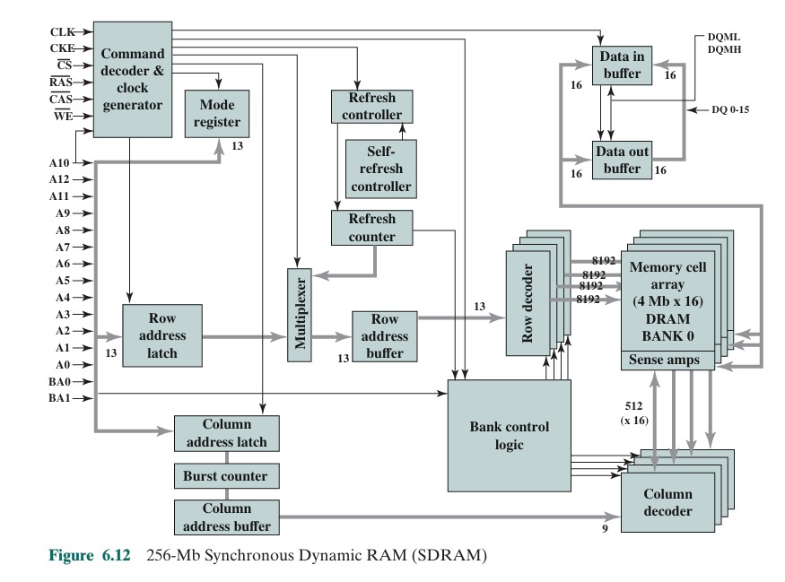

#+ATTR_HTML: :width 90% :align center
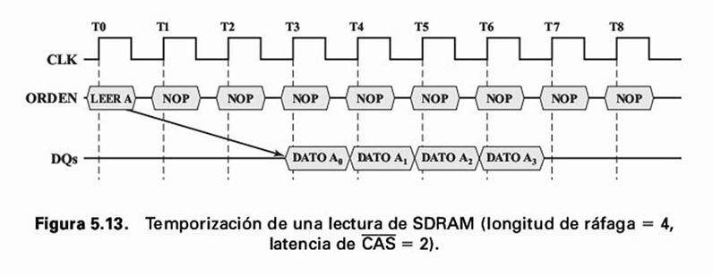
#+begin_export html
  

#+end_export

* 12. DDR SDRAM
** @@html:<i class="fas fa-tachometer-alt"></i>@@ Fundamentos DDR
#+begin_export html

  <strong>Double-Data-Rate:</strong> Transfiere datos dos veces por ciclo (flanco de subida y de bajada). Utiliza un <em>Prefetch Buffer</em> (búfer de precarga) que accede a múltiples palabras en paralelo internamente para no limitar el bus de I/O.

#+end_export

#+ATTR_REVEAL: :frag (appear)
- **DDR1:** Prefetch de 2 bits (velocidad 2x frente al núcleo).
- **DDR2:** Prefetch de 4 bits (velocidad 4x).
- **DDR3:** Prefetch de 8 bits (velocidad 8x).
- **DDR4:** Mantiene prefetch de 8 bits pero introduce **Bank Groups** (Grupos de bancos) para operar columnas en paralelo y alcanzar tasas de 2133 a 4266 Mbps.

** @@html:<i class="fas fa-chart-line"></i>@@ Evolución de Generaciones
#+ATTR_HTML: :width 75% :align center
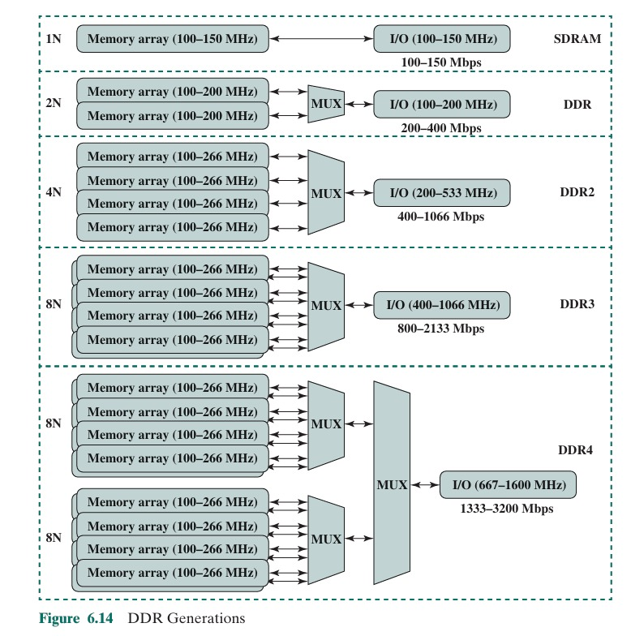

* 13. EDRAM (Embedded DRAM)
** @@html:<i class="fas fa-bolt"></i>@@ Características de EDRAM
#+begin_export html

  <strong>Ventaja Principal:</strong> Integra la tecnología DRAM en el mismo chip del procesador. Ofrece mayor densidad y disipa menos energía que la SRAM, reduciendo los tiempos de acceso por proximidad y buses anchos.

#+end_export

* 14. Implementaciones modernas
** @@html:<i class="fas fa-cogs"></i>@@ Implementaciones Modernas
#+ATTR_REVEAL: :frag (appear)
- **IBM z13:** Uso masivo compartido (Caché L3 de 64 MB por CPU y Caché L4 compartida de 480 MB).
- **Intel Core (Original):** Diseñada como caché L4 tradicional ("victim cache" de L3) con dependencias directas.
- **Intel Core (Actual):** Actúa como un **Búfer Transparente** directamente en el controlador de memoria. Acelera gráficos y PCIe sin pasar por el CPU.

#+ATTR_HTML: :width 65% :align center
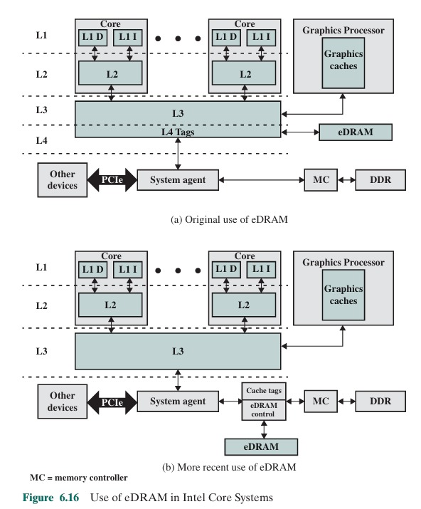

* 15. Memoria Flash
** @@html:<i class="fas fa-save"></i>@@ Principios de Operación
#+begin_export html

  <strong>Efecto Túnel:</strong> Utiliza un transistor con <em>Floating Gate</em> (puerta flotante).  
  Estado '1' = Vacía.  Estado '0' = Electrones atrapados al aplicar alto voltaje (escritura).

#+end_export

#+ATTR_REVEAL: :frag (appear)
- No volátil, borrado eléctrico por grandes bloques ("flashes").
- **NOR Flash:** Conexión en paralelo. Acceso aleatorio de alta velocidad por byte. Ideal para sistemas embebidos y ejecutar código.
- **NAND Flash:** Transistores en serie (16-32). Acceso por bloques. Densidad colosal, domina almacenamiento (SSDs, USBs).

** @@html:<i class="fas fa-object-group"></i>@@ Topología NOR vs NAND
#+begin_export html

  

#+end_export
#+ATTR_HTML: :width 95% :align center
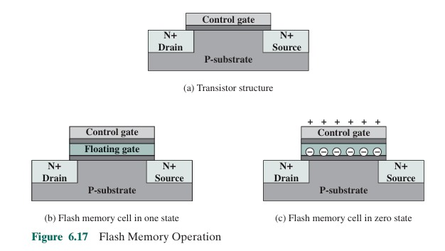
#+begin_export html
  

  

#+end_export
#+ATTR_HTML: :width 95% :align center
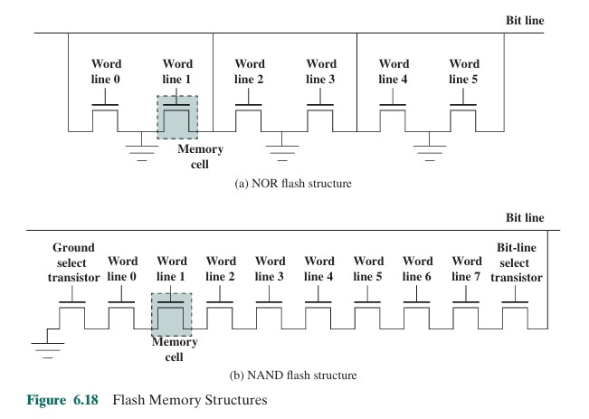
#+begin_export html
  

#+end_export

* 16. Memoria Flash (Flash Memory)
** @@html:<i class="fas fa-microchip"></i>@@ Origen y Evolución
#+begin_export html

  Es un tipo de memoria intermedia que revolucionó el almacenamiento. Nació a mediados de los años 80 porque se necesitaba algo rápido para borrar datos sin costar una fortuna.

#+end_export

#+ATTR_REVEAL: :frag (appear)
- Evolucionó combinando lo mejor de dos tecnologías anteriores:
- @@html:<strong>(EPROM):</strong>@@ Eran memorias que se borraban exponiéndolas a @@html:luz ultravioleta@@, lo cual era lentísimo y requería sacar el chip de la placa.
- @@html:<strong>(EEPROM):</strong>@@ Memorias más modernas que ya se borraban con electricidad, pero lo hacían @@html:<strong>byte por byte</strong>@@, de forma muy lenta.

#+ATTR_REVEAL: :frag (appear)
- La memoria Flash tomó la ventaja de borrado eléctrico de la EEPROM, pero lo hace a gran velocidad y en @@html:<strong>"bloques" enteros</strong>@@.
- Además, usa solo un transistor por bit, logrando una alta densidad.

** @@html:<i class="fas fa-cogs"></i>@@ ¿Cómo guarda y borra los datos físicamente?
#+begin_export html

  <strong>Compuerta flotante:</strong> En lugar de usar transistores comunes, añade un elemento clave (una pequeña "caja fuerte" aislada eléctricamente por óxido).

#+end_export

#+ATTR_REVEAL: :frag (appear)
- @@html:<strong>@@Estado Inicial (1 lógico):@@html:</strong>@@ La caja fuerte está vacía. La electricidad pasa libremente.
- @@html:<strong>@@Guardar datos (0 lógico):@@html:</strong>@@ Voltaje fuerte empuja electrones a cruzar el aislamiento (@@html:<strong>tunneling</strong>@@). Los electrones quedan atrapados de forma @@html:<strong>no volátil</strong>@@.
- @@html:<strong>@@Lectura:@@html:</strong>@@ Un circuito externo revisa si el transistor deja pasar corriente.
- @@html:<strong>@@Borrado:@@html:</strong>@@ Voltaje alto en dirección opuesta saca los electrones de golpe. Limpia @@html:<strong>bloques completos</strong>@@ a la vez.

** @@html:<i class="fas fa-network-wired"></i>@@ Tipos de Flash Memory
#+begin_export html

  

    

      <strong>NOR</strong>
    

    <ul style="font-size: 0.8em;">
      <li class="fragment"><strong>Conexión:</strong> Celdas organizadas en paralelo.</li>
      <li class="fragment"><strong>Ventaja:</strong> Acceso aleatorio rapidísimo a nivel de byte. Lee instrucciones directamente.</li>
      <li class="fragment"><strong>Aplicación:</strong> Código de arranque (firmware) en microcontroladores y sistemas embebidos.</li>
    </ul>
  

  

    

      <strong>NAND</strong>
    

    <ul style="font-size: 0.8em;">
      <li class="fragment"><strong>Conexión:</strong> Celdas en serie (cadenas de 16-32 transistores).</li>
      <li class="fragment"><strong>Ventaja:</strong> Ocupan menos espacio físico. Muy baratas y capacidad gigantesca.</li>
      <li class="fragment"><strong>Limitación:</strong> Obligada a leer/escribir en bloques/páginas. Sin acceso aleatorio directo.</li>
      <li class="fragment"><strong>Aplicación:</strong> Almacenamiento masivo (USBs, SDs, SSDs).</li>
    </ul>
  

#+end_export

* 17. Nuevas Tecnologías de Memoria Sólida No Volátil
** @@html:<i class="fas fa-rocket"></i>@@ El Límite Físico Actual
#+begin_export html

  <strong>El problema:</strong> Las memorias tradicionales (SRAM, DRAM y Discos Duros) están llegando a su límite físico; cada vez es más difícil hacer los chips más pequeños sin que fallen o consuman demasiada energía.

#+end_export

#+ATTR_REVEAL: :frag (appear)
- Estas nuevas tecnologías buscan el "santo grial":
- Combinar la @@html:<strong>velocidad extrema</strong>@@ de la memoria RAM.
- Con la @@html:<strong>no volatilidad</strong>@@ de no perder los datos al apagarse.

** @@html:<i class="fas fa-magnet"></i>@@ STT-RAM (Spin-Transfer Torque RAM)
#+begin_export html

  <strong>Evolución de MRAM:</strong> Utiliza el magnetismo en lugar de cargas eléctricas. Candidato para caché o memoria principal.

#+end_export

#+ATTR_REVEAL: :frag (appear)
- @@html:<strong>@@¿Cómo funciona?@@html:</strong>@@ Tiene una "Unión de Túnel Magnético" con una capa fija y una capa libre.
- @@html:<strong>Paralelas:</strong>@@ Electricidad pasa fácil (baja resistencia = 0).
- @@html:<strong>Antiparalelas:</strong>@@ Cuesta pasar (alta resistencia = 1). Se cambia la capa libre con corriente directa.
- @@html:<strong>Fuertes:</strong>@@ Rapidísima (<10 ns), altísima durabilidad (>$10^{15}$ ciclos) y cero consumo en standby.

** @@html:<i class="fas fa-fire-alt"></i>@@ PCRAM (Phase-Change RAM)
#+begin_export html

  <strong>Tecnología madura:</strong> Utiliza una aleación de calcogenuro (como en CDs/DVDs regrabables) pensada para reemplazar/complementar DRAM.

#+end_export

#+ATTR_REVEAL: :frag (appear)
- @@html:<strong>@@¿Cómo funciona?@@html:</strong>@@ Cambia el estado físico del material usando pulsos de calor:
- @@html:<strong>Estado Cristalino (SET):</strong>@@ Ordenado, deja pasar corriente (calentando un poco).
- @@html:<strong>Estado Amorfo (RESET):</strong>@@ Desordenado, bloquea la corriente (con chispazo fuerte y enfriamiento rápido).
- @@html:<strong>Fuertes:</strong>@@ Estabilidad física suprema, retiene información a largo plazo de forma segura.

** @@html:<i class="fas fa-microscope"></i>@@ ReRAM / RRAM (Resistive RAM)
#+begin_export html

  <strong>Memoria resistiva:</strong> Altera físicamente la resistencia de un óxido metálico. Candidata para memoria principal y masiva.

#+end_export

#+ATTR_REVEAL: :frag (appear)
- @@html:<strong>@@¿Cómo funciona?@@html:</strong>@@ Aplicando voltaje, se crean filamentos conductores en el óxido:
- @@html:<strong>Baja resistencia:</strong>@@ Filamentos creados, la corriente pasa (1 o 0).
- @@html:<strong>Alta resistencia:</strong>@@ Aplicando voltaje inverso, los filamentos se rompen.
- @@html:<strong>Fuertes:</strong>@@ Muy bajo voltaje (ahorro de energía), larga duración, tamaño celular microscópico teórico para tarjetas gigantescas.

** @@html:<i class="fas fa-table"></i>@@ Tabla Comparativa
#+begin_export html

  Comparación de los parámetros críticos de rendimiento entre las tecnologías semiconductoras tradicionales y alternativas emergentes:

#+end_export

#+ATTR_HTML: :width 85% :align center
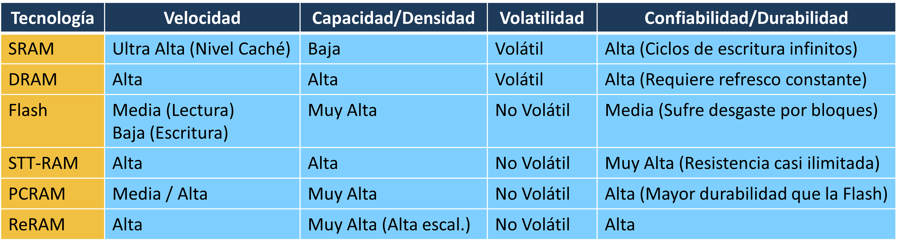

** @@html:<i class="fas fa-lightbulb"></i>@@ Conclusión del Desarrollo Tecnológico
#+begin_export html

  Toda la evolución estudiada busca combinar todas estas ventajas en una única memoria, objetivo que aún no se ha alcanzado.

  <strong> ¡No lo olvidemos!:</strong> A pesar de los colosales avances con STT-RAM o PCRAM, la arquitectura actual sigue dependiendo de una jerarquía fragmentada (Caché, RAM y Almacenamiento Secundario) porque ninguna tecnología comercial logra reunir de forma simultánea la velocidad extrema de la SRAM, la altísima densidad de la DRAM/NAND y la no volatilidad permanente a un costo viable.

#+end_export

* Fin de la Presentación
** @@html:<i class="fas fa-question-circle"></i>@@ ¿Preguntas?
#+begin_export html

  <h3 class="azul">¡Gracias por su atención!</h3>
  
Bibliografía: 
William Stallings, Antonio Cañas Vargas y Alberto Prieto Espinosa.
Organización y arquitectura de computadores. Pearson Educación,
2006.

#+end_export
